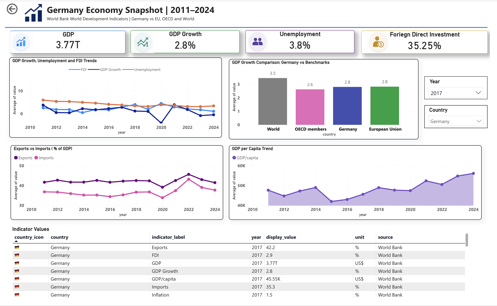

# Germany Economy Snapshot Dashboard | Power BI

## Project Overview

This project is a Power BI dashboard that analyzes Germany’s economic performance using World Bank World Development Indicators. The dashboard compares Germany with the European Union, OECD members, and the World across key macroeconomic indicators.

The goal of this project was to build a clean, interactive, Germany-focused business intelligence dashboard suitable for a data analyst / data science portfolio.

## Dashboard Preview

## Tools Used

- Power BI Online
- Excel Power Query
- DAX
- World Bank World Development Indicators
- Data cleaning and transformation
- Data visualization

## Dataset

**Source:** World Bank World Development Indicators  
**Countries / regions used:**

- Germany
- European Union
- OECD members
- World

**Years used:** 2011–2024

## Key Indicators

- GDP current US$
- GDP growth annual %
- Unemployment %
- Foreign direct investment net inflows % of GDP
- Exports of goods and services % of GDP
- Imports of goods and services % of GDP
- GDP per capita current US$

## Data Cleaning Steps

The original dataset was downloaded in wide format, where each year was stored as a separate column.

I cleaned the dataset using Excel Power Query:

1. Imported the raw World Bank dataset.
2. Removed incomplete 2025 data.
3. Kept only the indicators needed for the dashboard.
4. Unpivoted year columns into a long format.
5. Renamed columns into clean Power BI-friendly names.
6. Removed missing values.
7. Created helper columns for indicator labels, units, icons, and display values.

Final cleaned structure:

| country | country_code | indicator_name | indicator_code | year | value |
|---|---|---|---|---|---|

## Dashboard Features

- KPI cards for selected country and year
- Country and year slicers
- GDP Growth, Unemployment and FDI trend chart
- Germany vs benchmark comparison chart
- Exports vs Imports trend chart
- GDP per capita trend chart
- Latest indicator values table

## Skills Demonstrated

- Data cleaning with Power Query
- Wide-to-long data transformation
- Dashboard layout design
- KPI card creation
- Slicer-based interactivity
- DAX calculated columns and measures
- Business storytelling with economic indicators
- Germany-focused analytics for portfolio building

## Key Learning

This project helped me understand how to structure economic indicator data for Power BI and how to build an interactive dashboard from publicly available macroeconomic data.